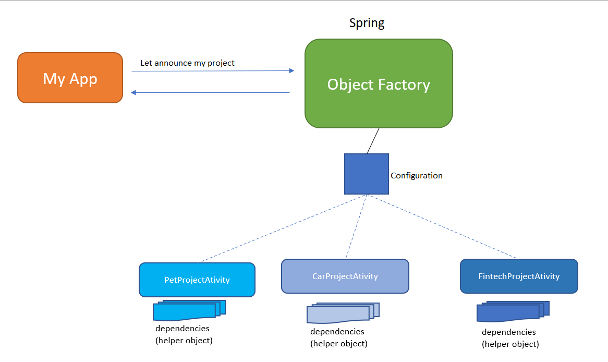

# Coding test 2020
**Design considerations** 
- As intention of announcing my pet project on twitter, hackernews or reddit. 
I need to build a system that allow I post a message to twitter, hackernews or reddit based on my configure.
And in the future, if I have other project and I want to use this system to announce my new project then I can configurable to announce my new project. So that, I can use IoC to control my system.
- In my system, each project will have some servers(helpers) to help them and these services can be configurable and won't change implementation of my Class. So that, We can use DI to inject services to my Class
 

 

**Limitation** 
- Currently, we can only post a message on once social network. If we want to post a message to other social network, we need to configure to inject other service to project. 
- I just implement PostMessage for TwitterMessageService. Other MessageService are not finished
 
 

**User Guide** 
- Go to application.properties and update your keys to able to can API from Twitter, Hackernews, Reddit 
- Currently, default project that I want to announce is Pet project. If you want to announce other project(such as Car project). You need to do: 
    + Remove @Component("projectActivity") in PetProjectActivity class 
    + Add @Component("projectActivity") to CardProjectActivity class  
- Default social network that I post a message is Twitter. If you want to use other social network(such as Reddit..). You need to do: 
    + Remove @Component in TwitterMessageService class 
    + Add @Component to RedditMessageService  
- Run ApplicationDemo class to post a message to social network     

