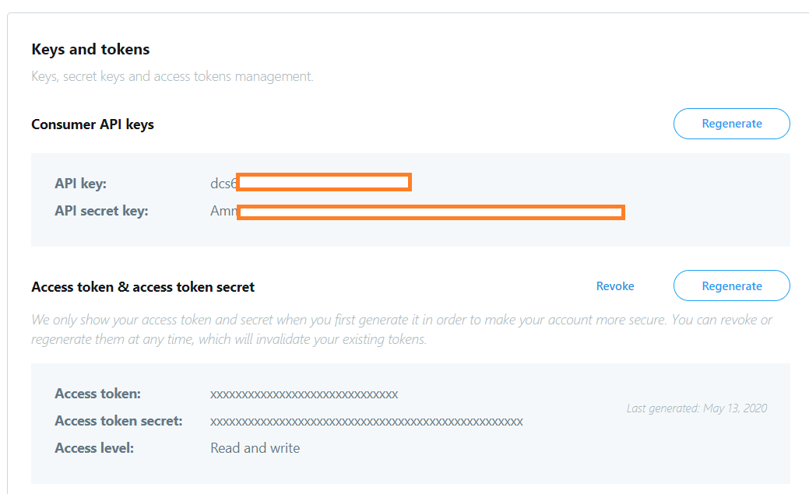
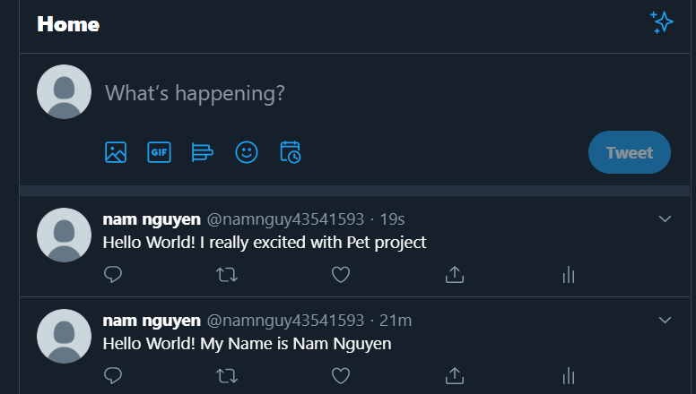
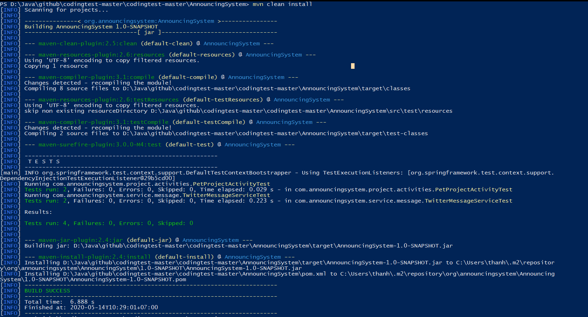

# Coding test 2020
**Design considerations** 
- As intention of announcing my pet project on twitter, hackernews or reddit. 
I need to build a system that allow I post a message to twitter, hackernews or reddit based on my configure.
And in the future, if I have other project(for example Car project) and I want to use this system to announce my new project then I can configurable to announce my new project. So that, I can use IoC to control my system.
- In my system, each project class( Pet, Card project...) will have some services(helpers) to help them and these services can be configurable and won't change implementation of my class. So that, We can use DI to inject services to my class
 

 

**Limitation** 
- Currently, we can only post a message on one social network at time. If we want to post a message to other social network, we need to configure to inject(DI) other service to project. 
- I just implement PostMessage for TwitterMessageService. Other MessageService are not finished
 
 

**User Guide** 
- Go to application.properties and update your keys to able to can API from Twitter, Hackernews, Reddit 

 

- Currently, default project that I want to announce is Pet project. If you want to announce other project(such as Car project). You need to do: 
    + Remove @Component("projectActivity") in PetProjectActivity class 
    + Add @Component("projectActivity") to CarProjectActivity class  
- Default social network that I post a message is Twitter. If you want to use other social network(such as Reddit..). You need to do: 
    + Remove @Component in TwitterMessageService class 
    + Add @Component to RedditMessageService  
- Go to ApplicationDemo class, update MESSAGE and run to post a message to social network     

 

**Run Test** 

If you want to run test. Just open project folder and run **mvn clean install**

**NEW UPDATE - Deploy to AWS as API Gateway with Lambda function**
- If you want to use a post message to social network function as RESTFUL API(we will use Post method for our function). We can deploy that function to AWS as Lambda function. Then we can create API gateway and point to that Lambda function. 
- We need to follow these steps below to deploy our stack to AWS:
1. **Switch to aws-api-with-lambda branch**
2. Install AWS CLI to your OS
3. Create configure for your AWS CLI
run : aws configure --profile <you_profile_name>

4. Create s3 bucket
run: aws s3 mb s3://<your_bucket_name> --profile <you_profile_name> --region <your_region>

5. Package our project and upload fat jar to s3 bucket
+ run: mvn clean package
+ Move to target folder and run command below to upload fat jar to s3 bucket:  
aws s3 cp AnnouncingSystem-1.0-SNAPSHOT-jar-with-dependencies.jar s3://<your_bucket_name>/AnnouncingSystem.jar  --profile <you_profile_name> --region <your_region>

6. Open api-lambda-deploy.yml in our project folder and change **S3Bucket** value to your <bucket_name>
7. Run command below to deploy our stack via CloudFormation
aws cloudformation create-stack --stack-name announcingsystem --template-body file://api-lambda-deploy.yml --region <your_region> --profile <you_profile_name> --capabilities CAPABILITY_NAMED_IAM

8. Check our stack on AWS CloudFormation and get an Endpoint

